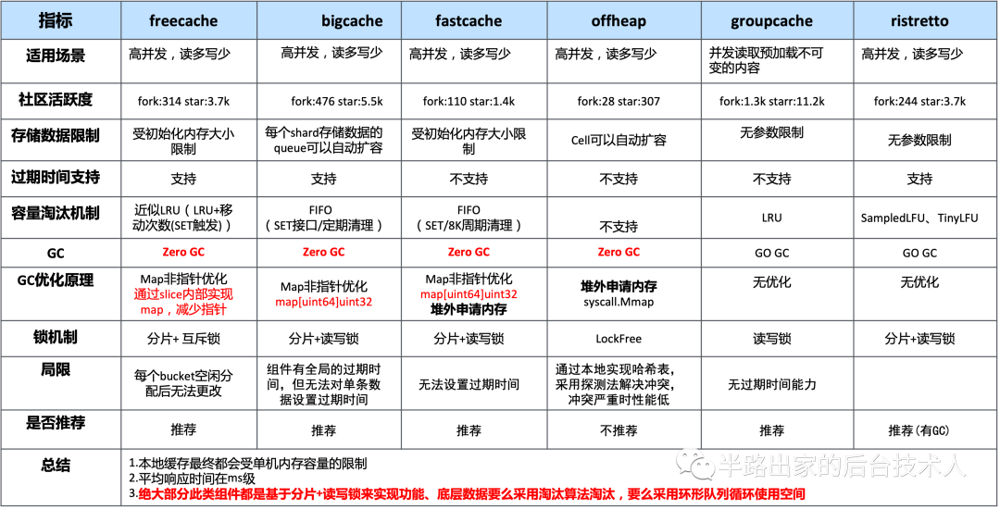
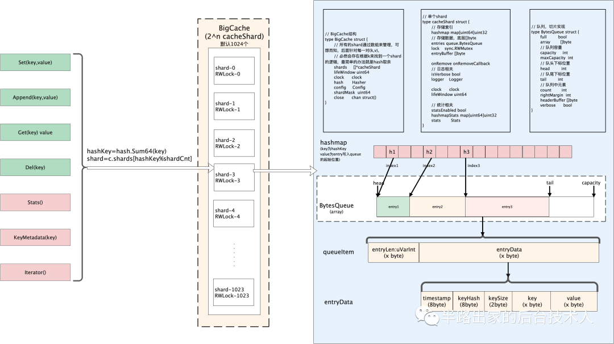
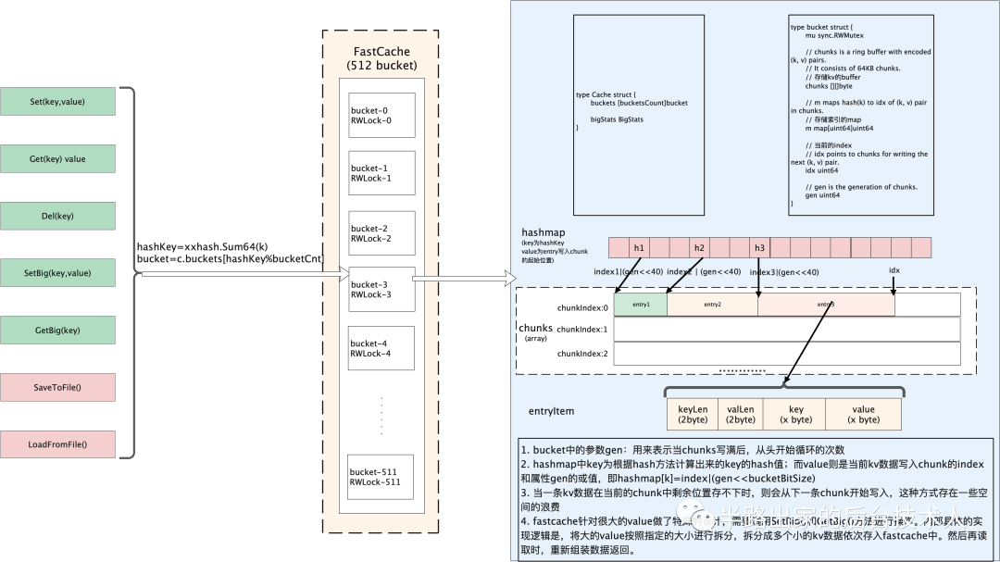
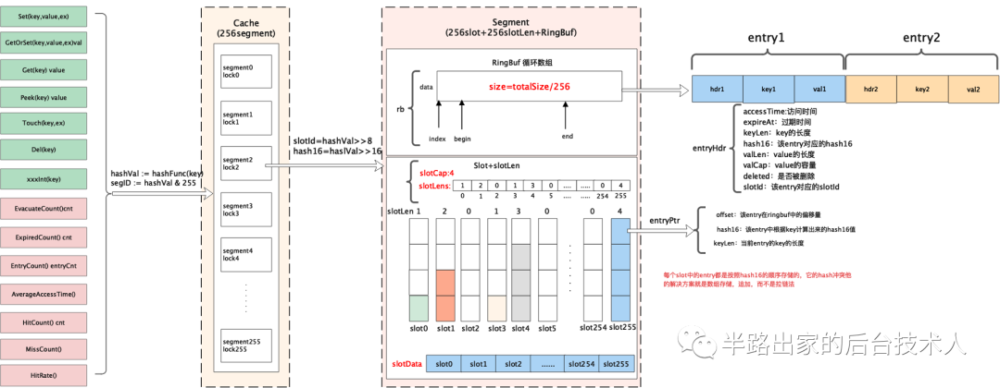
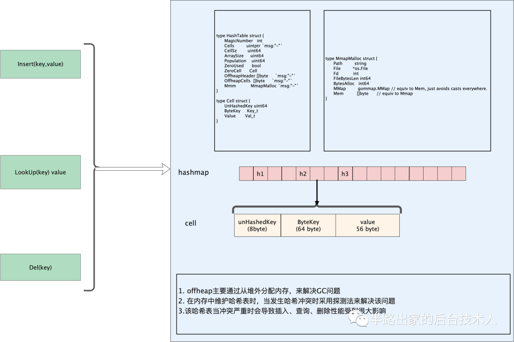

# local_cache

local cache 需求
- 较高读写性能+命中率
- 支持按写入时间过期
- 支持淘汰策略
- 解决GC，防止STW时间过长


实现零GC的方案主要有两种：
- 无GC：分配堆外内存（Mmap）
- 避免GC：map 非指针优化（map[uint64]uint32）*1或者用slice实现一套无指针的map
- 避免GC：数据存入[]byte slice 
实现高性能的关键在于：
- 数据分片（降低锁的粒度）

```aidl
// 非指针类型如int32 uint32 不会被分配到堆上，从而可以避免被GC扫到
// slice 的gc时间远远快于map， 而map存储指针是最慢的
```
## bigcache


bigcache整体思路跟freecache 差不多，但bigcache不支持单独设置过期时间。


## fastcache


fastcache基于bigcache实现了直接从堆外申请内存，自己实现了分配和释放内存的逻辑，降低GC的影响

## freecache


freecache实现原理：
通过segment来进行对数据分片，freecache 内部包含256 个segment， 每个segment维护一把互斥锁，每一条
KV数据进来后首先会根据k进行计算其hash值，然后根据hash值来决定当前这条数据落到那个segment中


## offheap


ref:

[Go语言的实时GC——理论与实践](https://segmentfault.com/a/1190000010753702?_ea=2426880)